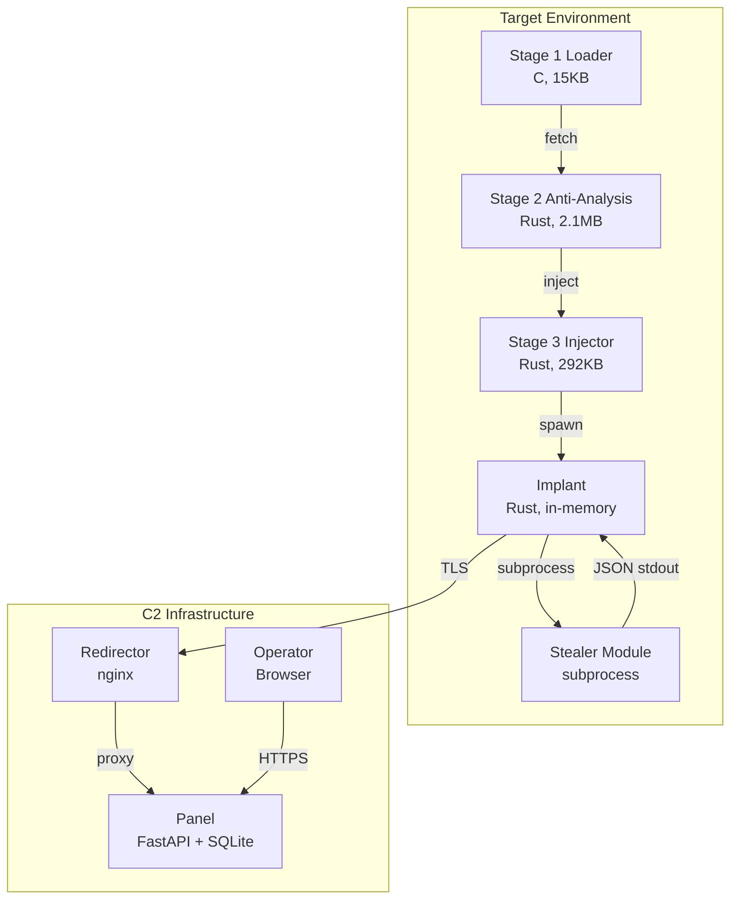
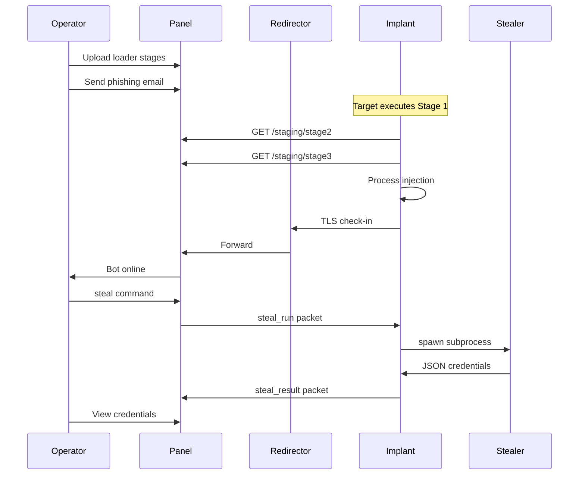
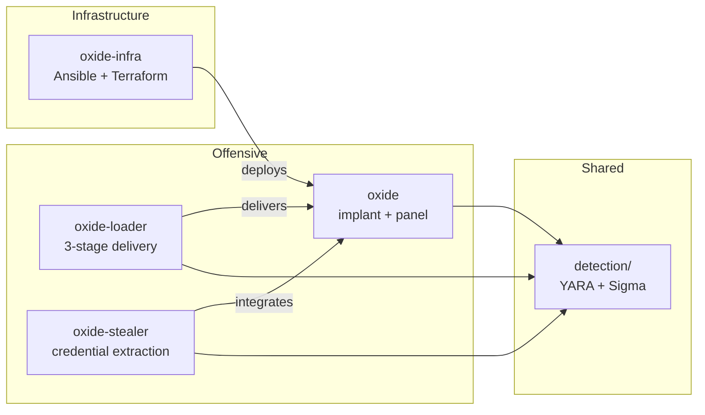

# Oxide Architecture

Visual overview of the Oxide framework components and data flow.

## System Overview



## Attack Chain Sequence



## Repository Structure



## Component Details

| Component | Language | Size | Purpose |
|-----------|----------|------|---------|
| oxide-implant | Rust | ~500KB | Cross-platform implant with 7 command handlers |
| oxide-panel | Python | — | FastAPI web panel, SQLite storage, WebSocket updates |
| oxide-loader/stage1 | C | 15KB | Minimal stub, XOR decrypt, HTTP fetch |
| oxide-loader/stage2 | Rust | 2.1MB | Anti-analysis, environment checks |
| oxide-loader/stage3 | Rust | 292KB | Process injection, memory-only execution |
| oxide-stealer | Rust | — | Browser creds, cookies, SSH keys extraction |

## Network Architecture

```
┌─────────────────────────────────────────────────────────────┐
│                    Target Network                           │
│  ┌─────────┐                                                │
│  │ Implant │──────┐                                         │
│  └─────────┘      │                                         │
│  ┌─────────┐      │  TLS :4444                              │
│  │ Implant │──────┼──────────────────┐                      │
│  └─────────┘      │                  │                      │
│  ┌─────────┐      │                  ▼                      │
│  │ Implant │──────┘           ┌─────────────┐               │
│  └─────────┘                  │ Redirector  │               │
│                               │   (nginx)   │               │
└───────────────────────────────┴──────┬──────┴───────────────┘
                                       │
                            Internet   │  Proxy pass
                                       │
┌──────────────────────────────────────┼──────────────────────┐
│           C2 Infrastructure          │                      │
│                               ┌──────▼──────┐               │
│                               │   Panel     │               │
│   ┌──────────┐    HTTPS       │  (FastAPI)  │               │
│   │ Operator │◄───────────────┤   :8080     │               │
│   │ Browser  │                │   :4444     │               │
│   └──────────┘                └─────────────┘               │
│                                                             │
└─────────────────────────────────────────────────────────────┘
```

## Detection Coverage

Every component has paired detection rules:

| Component | YARA | Sigma | Network |
|-----------|------|-------|---------|
| Implant | ✓ | ✓ (persistence, beaconing) | JA3/JA4 |
| Loader Stage 1 | ✓ | ✓ (network fetch) | — |
| Loader Stage 2 | ✓ | ✓ (VM/debug checks) | — |
| Loader Stage 3 | ✓ | ✓ (injection) | — |
| Stealer | ✓ | ✓ (credential access) | — |

See `detection/COVERAGE_MATRIX.md` for full mapping.
